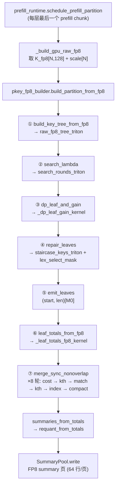

# Scale — Adaptive-HISA P-key Split / Merge 算子

这个仓库是 Adaptive-HISA(DeepSeek-V3.2 DSA 稀疏注意力上的自适应 KV chunk 划分)中
**Split / Merge 算子**以及 **Decode 选择算子**的代码快照,从 SGLang 集成分支
`adaptive_0921_h201` 中抽出,目录扁平化。仓库只包含算子和参考实现,不包含 SGLang
运行时胶水(`prefill_runtime.py` / `decode_runtime.py` / `summary_pool.py` / `config.py`)。

源码路径(在 SGLang 中):
`python/sglang/srt/layers/attention/nsa/adaptive_hisa/`,`.cu` 文件在其 `csrc/` 子目录。

---

## 1. 问题背景

DSA 在 decode 时对每个 query 只保留 top-2048 个 token 的 KV。官方做法是对全部 N 个
token 做一次 FP8 MQA 打分再 top-k;HISA 的做法是把 KV 按固定 64 token 切成 chunk,
先用 chunk 的 summary key 做粗打分,再对少量候选做精打分。

Adaptive-HISA 把**固定 64-token chunk 换成自适应长度的 chunk**:在 prefill 结束时,
用每层的 index key(`K_fp8[N,128] + scale[N]`)按 Key-SSE 能量把序列切成
`N / 64` 个长度不等的叶子(平坦区域给长叶子,变化剧烈区域给短叶子),每个叶子用
`mean(K)` 做 FP8 summary。Decode 时先对 summary 打分,再按 token 预算精确选出候选。

划分分两步:

| 步骤 | 输入 → 输出 | 方法 |
| --- | --- | --- |
| **Split** | `N` token → 恰好 `M0 = N/8` 个 dyadic 叶子 | 全局 λ-DP + exact repair |
| **Merge** | `N/8` 个叶子 → `N/64` 个任意长度叶子 | 相邻 Ward cost、同步不重叠贪心合并 |

默认参数:`ATOM=1`,`ROOT=256`,`SUMMARY_COMPRESSION=8`(`M0 = N/8`),
`merge_target_divisor=64`(目标 `N/64`),`lambda_candidates=16`,
`merge_target_rounds=8`,decode 端 `DECODE_CHUNK=64`。

---

## 2. 文件清单

### Split / Merge(prefill 端)

| 文件 | 作用 |
| --- | --- |
| `pkey_fp8_builder.py` | **总入口** `build_partition_from_fp8`:建树 → Split → Merge → summary totals。所有阶段的调度和 profile 事件都在这里。 |
| `partition_gpu.py` | GPU backend 编排层:`TreeLayout`、`search_lambda`、`dp_leaf_and_gain`、`repair_leaves`、`emit_leaves`、`merge_sync_nonoverlap`、`GpuPartition`。每个函数都有 torch fallback,是 Triton kernel 的语义参考。 |
| `partition_kernels.py` | **全部 Triton kernel**:建树、λ-DP、leaf mask/gain、staircase、merge cost/match/compact,以及它们的 host 侧 launcher。 |
| `partition_select.py` + `radix_select.cu` | 精确 k-th **radix selection** CUDA 算子,替代原来只为读一个阈值而做的 `torch.sort`。用于 repair(`lex_select_mask`)和 target merge(`kth_threshold_f64`)。 |
| `prefill_partition.py` | 共享数据结构(`PrefillPartition`、`PartitionInputs`)、`n_complete_tokens`、叶子校验、以及 CPU 参考 build 的调度。 |
| `partition_reference.py` | CPU(numpy/numba)参考求解器:`_dp_solve`、heap repair、`sync_nonoverlap_merge`。GPU 路径的 parity 基准。 |
| `summary_kernels.py` | 最终叶子的 `sum(K)/len` → FP8 requant(`requant_from_totals`),与模型 `act_quant` 约定一致。 |

### Decode 端

| 文件 | 作用 |
| --- | --- |
| `weighted_select.cu` + `decode_select.py` | token 预算的**精确叶子选择器**:按 summary 得分从高到低选叶子,直到累计 token 数填满 `candidate_tokens`(默认 8192),含 sink/tail guard,crossing 叶子部分截取。 |
| `decode_kernels.py` | 固定 shape 的候选展开(叶子 → token id 列表)和 raw paged FP8 gather。 |
| `segment_scorer.py` | 区间感知的 FP8 MQA fine scorer:按 `(start, len, offset)` 区间走,相邻 token 共享 page-table 查找。 |
| `incremental.py` | 生成阶段新 token 的固定 64-chunk 封存和 summary 写回。 |

---

## 3. 调用链

### 3.1 Prefill:构建 partition



文字版:

```
prefill_runtime.schedule_prefill_partition
  └─ _schedule_key_partition
       └─ _build_gpu_raw_fp8                       (RAW_FP8_BUILDER=1, split_backend=gpu)
            ├─ pkey_fp8_builder.build_partition_from_fp8
            │    ├─ build_key_tree_from_fp8        → partition_kernels.raw_fp8_tree_triton
            │    ├─ partition_gpu.search_lambda    → partition_kernels.search_rounds_triton
            │    ├─ partition_gpu.dp_leaf_and_gain → partition_kernels.dp_leaf_and_gain_triton
            │    ├─ partition_gpu.repair_leaves    → partition_kernels.staircase_keys_triton
            │    │                                  + partition_select.lex_select_mask (radix_select.cu)
            │    ├─ partition_gpu.emit_leaves      (torch scatter)
            │    ├─ leaf_totals_from_fp8           → partition_kernels.leaf_totals_fp8_triton
            │    └─ partition_gpu.merge_sync_nonoverlap
            │         └─ 每轮: partition_kernels.merge_costs_triton
            │                  partition_gpu.kth_cost_threshold  → partition_select.kth_threshold_f64
            │                  partition_kernels.merge_round_triton
            │                     (_merge_match_kernel → _kth_threshold → _merge_index_kernel → _merge_compact_kernel)
            ├─ pkey_fp8_builder.summaries_from_totals → summary_kernels.requant_from_totals
            └─ SummaryPool.write
```

`build_partition_from_fp8` 返回 `GpuPartition`:`leaf_start/leaf_len[int32, storage]`、
`num_leaves`(device 标量)、`lambda`、以及 `meta["_merge_totals"]`(最终叶子的
`sum(K)`,直接喂 summary,避免再扫 raw K)。

### 3.2 Decode:用 partition 选 top-2048

```
decode_runtime.maybe_decode_topk            (每层,B=1,可被 CUDA graph 捕获)
  └─ select_topk
       ├─ incremental._maybe_seal            新生成的 64-token chunk 封存为叶子 + summary
       ├─ deep_gemm.fp8_paged_mqa_logits     q × summary 页 → 每个叶子一个粗分  [capacity]
       ├─ decode_select.weighted_select_candidates   (weighted_select.cu)
       │      按分数降序选叶子,累计 token 直到 candidate_tokens=8192;
       │      sink(前 64)/tail(后 256)guard 必选;crossing 叶子部分截取;输出按逻辑 token 序
       │   或 weighted_select_intervals → (start, len, offset) 区间       (segment 模式)
       ├─ fine rescore
       │      sparse_paged_mqa_triton (K=1, 每候选 token 一个 block)
       │   或 segment_scorer.sparse_paged_mqa_segments
       └─ hisa_topk_candidates_fused          候选 → top-2048 → (可选) 直接融合成物理页索引
```

---

## 4. Split 过程详解

### 4.1 Key-SSE 能量树(`build_key_tree_from_fp8` → `raw_fp8_tree_triton`)

对 `N_complete = ⌊N/256⌋·256` 个 token(不足一个 root 的尾部不参与划分),按
`atom=1, root=256` 建一片森林:每棵 root 有 `log2(256)+1 = 9` 层 dyadic 节点
(长度 1, 2, 4, …, 256),整片森林约 `2N` 个节点,按 **level-major** 展平成
`flat[n_nodes]` fp64。

每个节点存的是 P-key 能量

```
SSE(node) = Σ_d ( Σ_t k[t,d]²  −  (Σ_t k[t,d])² / len )      t ∈ node
```

即该区间内 128 维 key 到区间均值的平方距离和。**全程 FP64**(`KEY_MOMENT_DTYPE=fp64`),
FP32 只作实验。

Triton 实现分两级,避免物化 `[N,128]` FP32 K 和 FP64 prefix:

* `_fp8_chunk_tree_kernel`:每 16 token 一个 program,dequant 后 `[16,128]` fp64 tile
  留在寄存器里逐层归约(level 0..4),写出各层 SSE 和该 chunk 的两个 `[128]` moment;
* `_fp8_upper_tree_kernel`:每棵 root 一个 program,读 16 个 chunk moment 归约出
  level 5..8。

### 4.2 全局 λ-DP(`search_lambda` → `search_rounds_triton`)

给每个叶子加固定惩罚 λ,做自底向上的 DP:

```
cost(node) = min( SSE(node) + λ ,  cost(left) + cost(right) )
```

λ 越大叶子越少,`count(λ)` 单调不增。目标是找**使 `count(λ) ≤ M0` 的最小 λ**。

* 每棵 root 的子树独立,所以一个 Triton program 处理一棵 root、同时算 `KC=8` 个 λ
  (`DP_WARPS=1`,一个 warp;测得比 4 warps×16 λ 快 1.7×);
* 一轮评估 `K=16` 个候选 λ(区间 `[lo, hi]` 的 `1/17 … 16/17` 分位),
  `_dp_count_reduce_kernel` 用原子加把叶子数直接归约成 `[K]`,
  `_bracket_from_totals_kernel` 在 device 上更新 `[lo, hi, count(hi), done, used]`;
* 轮数固定 `ceil(log(1/rel_tol)/log(K+1))`(`rel_tol=1e-12` → 10 轮),
  `lambda_deficit_tol ≥ 0` 时可 device 侧提前收敛(launch 数不变,kernel 直接返回)。

### 4.3 叶子 mask + split gain(`dp_leaf_and_gain` → `_dp_leaf_gain_kernel`)

用最终 λ 再跑一次 DP,自顶向下生成 `is_leaf[n_nodes]`,同时输出每个节点的
`gain = SSE(node) − SSE(left) − SSE(right)`(再切一刀能减少多少能量),供 repair 用。
一次扫描完成,不再回读整棵树。

### 4.4 Exact repair(`repair_leaves`)

λ-DP 只保证 `count ≤ M0`,一般差 `deficit = M0 − count` 个。repair 把 gain 最大的
叶子继续切成两半,直到**恰好** `M0`。参考实现是一个 heap(key 为
`(gain desc, start asc, level asc, idx asc)`),GPU 实现把它变成一次选择:

1. 按 heap key 对所有节点排一次名次 `rank`(`torch.sort`,一次);
2. `_staircase_kernel`:对每个可达节点(当前叶子及其后代)生成"从叶子到它的路径上
   祖先 rank 的字典序 key"(打包到 `STAIR_PER` 个 int64);heap 依次 pop 的顺序等价于
   这些 key 的字典序;
3. `partition_select.lex_select_mask`(`radix_select.cu`):选出字典序最小的
   `deficit` 个可达节点,只写 1 byte mask,不做全量 sort;
4. `new_leaf = (is_leaf & ~popped) | (children(popped) & ~popped)`。

### 4.5 输出叶子(`emit_leaves`)

把 `is_leaf` 压成按 start 排序的 `(start, len)[M0]`。用"标记每个叶子的首 atom → prefix
sum"得到输出槽位,无 sort。padding 行 `start = n_tokens, len = 0`。

---

## 5. Merge 过程详解(`merge_sync_nonoverlap`,target 模式)

输入:Split 的 `M0 = N/8` 个 dyadic 叶子,`totals[M0,128]` fp64 = 每个叶子的 `sum(K)`
(`_leaf_totals_fp8_kernel` 直接从 FP8 分段累加),`means = totals / len`。
目标:合并到 `target = N/64` 个叶子。

相邻两叶子 `l, r` 的 **Ward cost**:

```
cost(l,r) = n_l·n_r / (n_l + n_r) · ‖mean_l − mean_r‖²
```

即合并后 SSE 的增量。每轮同步地选一批**互不重叠**的相邻边一起合并,固定跑
`merge_target_rounds = 8` 轮(实际 2–5 轮即收敛,其余为空转轮),每轮 6 个 launch:

| # | 步骤 | kernel / 函数 | 说明 |
| --- | --- | --- | --- |
| 1 | cost | `_merge_cost_kernel` | 每条相邻边的 Ward cost,不合格边(越过 `count`、超 `max_merge_len`)写 `+inf`。用预先算好的行均值,kernel 内无 fp64 除法。 |
| 2 | 阈值 1 | `kth_threshold_f64`(`radix_select.cu`) | `deficit = count − target`;取第 `2·deficit` 小的 cost 作阈值(`TARGET_ADMIT_FACTOR=2`:不重叠匹配大约保留一半候选边)。 |
| 3 | match | `_merge_match_kernel` | **单 program**(`BLOCK ≥ cap`,32 warps),对 `cost < thr` 的边做 `(cost, start)` 贪心不重叠匹配:局部极小直接选;单调段用"到最近局部极小的距离奇偶"决定;局部极大仅在两侧都没选时补选。两次 `associative_scan` + 一次 `cumsum`。 |
| 4 | 阈值 2 | `_kth_threshold` | 在已匹配边里再取第 `deficit` 小,防止超合并(overshoot)。 |
| 5 | index | `_merge_index_kernel` | 按最终选择重算 `src[dst]` 压紧映射和 `new_count`。 |
| 6 | compact | `_merge_compact_kernel` | 左叶子吸收右叶子的 `len` 和 `totals`,按 `src` 压紧写入 ping-pong buffer;顺带写出新行的 `means` 给下一轮。只写活跃行,死尾 program 立即退出。 |

阈值为 `-inf` 的空转轮(target 已达成)在 cost/match/index/compact/k-th 里都是
device 侧早退,**launch 数不变**,所以整条 build 可以被 CUDA graph 捕获。

最终 `totals` 直接交给 `summary_kernels.requant_from_totals` 生成 FP8 summary。

---

## 6. 设计约束(优化时必须保持)

1. **无 host sync**:`count`、`deficit`、`lambda`、`num_leaves` 全是 device 标量;
   任何 tensor 的 shape 只由 host 已知整数(`N_complete`、`M0`、`storage`)决定。
   不能出现 `.item()`、`nonzero()`、布尔索引。
2. **CUDA graph 可捕获**:launch 数量和顺序对给定 `N` 固定;数据相关的分支只能在
   kernel 内部早退。
3. **数值语义 bit-identical**:
   * Split 结果必须与 `partition_reference._dp_solve` + heap repair 一致;
   * Merge 结果必须与 `partition_reference.sync_nonoverlap_merge`(以及
     `merge_sync_nonoverlap` 的 torch fallback 分支)一致;
   * radix selection 必须与 `torch.sort` 路径一致(含边界 tie);
   * Ward cost 用 `t / n` 的 IEEE fp64 除法,先算 mean 再算 cost 与原来 inline 除法
     bit 相同。
4. **FP64 moment**:SSE、gain、cost、totals 都是 fp64;FP32 会改变叶子划分。
5. Triton kernel 缺失 / 非 CUDA 时必须能回落到 `partition_gpu.py` 里的 torch 实现。

---

## 7. 我们想优化什么

Prefill 端每层都要跑一次完整 build(DeepSeek-V3.2 有 61 层 indexer)。以 32K 上下文为例,
整条 build 约 **210 个 launch**、约 2 ms host 时间(`partition_gpu.py` 文档中的量级);
128K 时 `M0 = 16K`、`cap = 16K`,merge 单 program 的 match kernel 和 `[16K,128]` fp64
totals/means 的读写开始占主导。`build_partition_from_fp8(..., profile=True)` 会返回
`events = {tree_s, dp_s, repair_s, merge_s, total_s}` 的 CUDA event 对,可直接分段计时。

按阶段的已知热点和可能方向(仅供讨论,均未实施):

**建树(`raw_fp8_tree_triton`)**
* 两级 kernel 之间 chunk moment `[N/16, 2, 128]` fp64 落地一次;可考虑单 kernel 每 root
  直接建完(现有 `single_program=True` 参考路径在 R=256 会 spill,需要换 tile 策略)。

**λ 搜索(`search_rounds_triton`)**
* 10 轮 × 2 launch,每轮都从 HBM 重读整棵 `flat`(约 `2N × 8B`)。
  方向:一个 persistent kernel 内完成多轮(root 间需 grid 级同步),或每轮评估更多候选
  减少轮数,或用 `lambda_deficit_tol` 提前停并把差额交给 repair(已支持,默认关)。
* `_dp_count_reduce_kernel` 用原子加归约 `[K]`;root 数很多时原子竞争可换两级归约。

**Repair(`repair_leaves`)**
* 仍有一次全量 `torch.sort(gain)` 算 rank(`2N` 个 fp64),是 Split 里唯一的排序。
  只有可达节点(叶子及其后代,≈ `M0` 量级)真正需要名次,可以只对它们排序,或改成
  分桶 rank。
* `_staircase_kernel` 的 key 宽度受 `bits × STAIR_PER ≤ 63` 限制,更长上下文需要多 word。

**Merge(`merge_sync_nonoverlap`)**
* `_merge_match_kernel` 是**单 program**,`cap = M0 = N/8`,128K 时 `BLOCK = 16384`,
  一个 SM 做全部 scan;可以做多 block 的分段 scan + 边界修正(注意不重叠匹配跨 block
  边界的语义)。
* 每轮 compact 读写 `[cap,128]` fp64 totals + means 各一遍(128K 时约 32 MB/轮),
  空转轮仍要拷贝一遍(ping-pong 语义)。方向:空转轮 device 侧跳过拷贝、fp64 → 更紧的
  表示(但会破坏 bit 一致性,需要重新验证精度)、或只搬动被合并的行。
* 每轮 2 次 `kth_threshold_f64`(radix select,64-bit key 6 pass × 读一遍 cost)。
  可考虑 cost 单调性/上一轮阈值做 warm start 减少 pass。
* 8 轮固定;实测 2–5 轮收敛,剩余是空转。若能在 graph 外知道上限可以减少轮数。

**整体**
* 61 层 × ~210 launch 的 host 开销;当前通过 `GraphedBuilder`(`partition_gpu.py`)
  按 `(n_queries, n_tokens, cfg)` 缓存 CUDA graph 来消除,前提是所有 kernel 满足第 6 节约束。
* 建树、λ-DP、repair 都在 root 粒度独立,理论上可以按 root 分片和 attention 重叠,
  目前是在最后一个 prefill chunk 后于旁路 stream 上整体运行。

**Decode 端(`weighted_select.cu`)**
* 生产 fast path:一次 token 加权高字节直方图 → 只打包阈值 bucket → 3 次 radix pass →
  一次稳定扫描处理 leaf-index tie;capacity > 4096 回落到 6-pass 精确路径。
  更长上下文(叶子数 > 4096)会频繁走 fallback,是下一步的热点。

---

## 8. 参考实现与验证

* `partition_reference.py`:CPU 精确算法(`_dp_solve`、heap repair、
  `sync_nonoverlap_merge`),所有 GPU 改动必须先过 parity。
* `partition_gpu.py` 里每个 Triton 入口都有同名 torch 分支(`_dp_leaf_mask_torch`、
  `merge_sync_nonoverlap` 的非 Triton 分支、`repair_leaves` 的 sort 分支等),在
  `use_triton` 返回 False 时使用,也是 kernel 的语义定义。
* `pkey_fp8_builder._build_key_tree_torch` 是建树的物化参考。
* 精度验证在 SGLang 侧的 LongBench-v2 / RULER 32k·128k 评测里做,和官方 DSA 对比。
